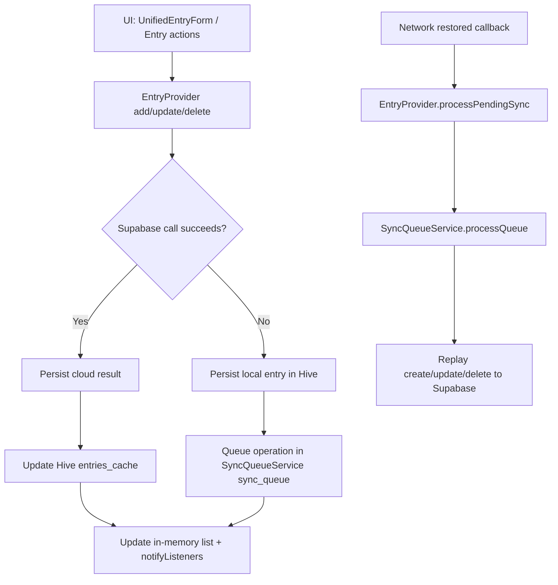
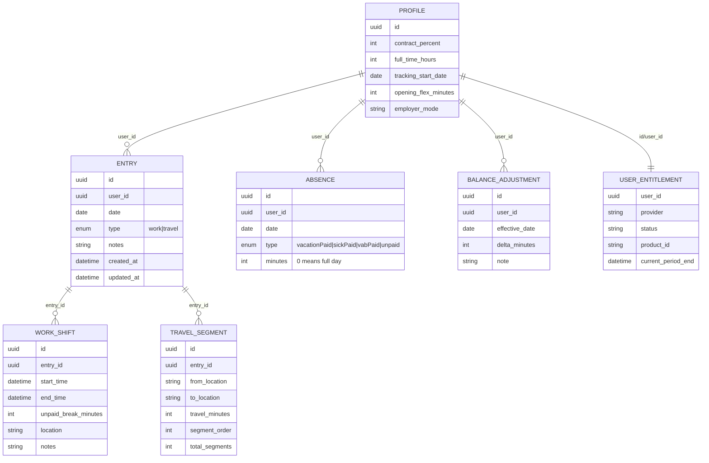

# KvikTime Blueprint / Source of Truth

This document is a code-backed technical blueprint for `apps/mobile_flutter`.
It is based on repository implementation, not assumptions.

---

## 1) Executive overview

KvikTime is a Flutter app for logging and verifying time with:
- work and travel entries as proof-of-time records
- leave records (paid/unpaid) as credited time inputs
- time-balance views for target vs actual accounting
- export for payroll/admin verification
- offline-first local caching with queued sync to cloud

Primary user value in code today:
- proof of tracked time from atomic entries (`Entry`)
- payroll/balance context from target + leave credit + adjustments
- cross-device continuity through Supabase-backed data

Core domain split:
- `Tracked`: work + travel from entries only
- `Credited`: paid leave minutes (vacation/sick/VAB)
- `Balance offsets`: opening balance + manual adjustments

References:
- `apps/mobile_flutter/lib/models/entry.dart` (`Entry`, `Shift.workedMinutes`, `Entry.workDuration`, `Entry.travelDuration`)
- `apps/mobile_flutter/lib/models/absence.dart` (`AbsenceEntry`, `AbsenceType`, `isPaid`)
- `apps/mobile_flutter/lib/reports/report_aggregator.dart` (`ReportAggregator.buildSummary`, `LeavesSummary.creditedMinutes`, `BalanceOffsetSummary`)
- `apps/mobile_flutter/lib/reporting/accounted_time_calculator.dart` (`AccountedTimeCalculator.compute`)

---

## 2) Technology and architecture

### Stack
- UI: Flutter Material 3
- State: `provider` / `ChangeNotifier`
- Navigation: `go_router`
- Local storage/cache: Hive + SharedPreferences
- Cloud/backend: Supabase (auth + Postgres tables), plus HTTP endpoints
- Billing: Google Play Billing (`in_app_purchase`)

References:
- `apps/mobile_flutter/lib/main.dart` (`_bootstrapAndRunApp`, `MyApp`)
- `apps/mobile_flutter/lib/config/app_router.dart` (`AppRouter.router`)
- `apps/mobile_flutter/lib/services/supabase_config.dart` (`SupabaseConfig.initialize`)
- `apps/mobile_flutter/lib/services/billing_service.dart` (`BillingService`)

### App structure (high-level)
- `lib/models`: domain models (`Entry`, `AbsenceEntry`, `BalanceAdjustment`, `UserProfile`)
- `lib/providers`: app state and orchestration (`EntryProvider`, `TimeProvider`, `SettingsProvider`, etc.)
- `lib/services`: IO/services (Supabase services, export, billing, reminders)
- `lib/reporting`: source-of-truth calculators/formatters (`TimeRange`, tracked/accounted calculators)
- `lib/reports`: report query and aggregation
- `lib/screens` + `lib/widgets`: UI

### State management pattern
- Providers are registered in `main.dart` with dependency wiring.
- `ChangeNotifierProxyProvider` is used where providers depend on other providers/auth.
- `ReportsScreen` creates/binds `CustomerAnalyticsViewModel` from `EntryProvider`.

References:
- `apps/mobile_flutter/lib/main.dart` (`MultiProvider`, `ChangeNotifierProxyProvider...`)
- `apps/mobile_flutter/lib/screens/reports_screen.dart` (`ChangeNotifierProxyProvider<EntryProvider, CustomerAnalyticsViewModel>`)

### Backend APIs actually referenced by mobile app
- Profile/bootstrap/legal:
  - `POST /api/mobile/profile/bootstrap`
  - `POST /api/mobile/legal/accept`
  - `GET /api/mobile/legal/current`
- Billing verify:
  - `POST /api/billing/google/verify`
- Delete account:
  - `DELETE /api/delete-account`
- Analytics/admin:
  - `$KVIKTIME_API_BASE/analytics/dashboard` (or Supabase functions base)

References:
- Mobile callers:
  - `apps/mobile_flutter/lib/services/profile_service.dart`
  - `apps/mobile_flutter/lib/services/entitlement_service.dart`
  - `apps/mobile_flutter/lib/services/billing_service.dart`
  - `apps/mobile_flutter/lib/services/supabase_auth_service.dart`
  - `apps/mobile_flutter/lib/services/analytics_api.dart`
  - `apps/mobile_flutter/lib/services/admin_api_service.dart`
- Backend route files in repo:
  - `apps/web/app/api/mobile/profile/bootstrap/route.ts`
  - `apps/web/app/api/mobile/legal/accept/route.ts`
  - `apps/web/app/api/mobile/legal/current/route.ts`
  - `apps/web/app/api/billing/google/verify/route.ts`
  - `apps/web/app/api/delete-account/route.ts`

`NOT IMPLEMENTED (in this repo as Next.js route source)`: `/analytics/dashboard` route source is not present under `apps/web/app/api`; mobile points to external base URL/function base.

### Auth and data ownership
- Auth: Supabase Auth (`SupabaseAuthService`).
- Ownership: queries are user-scoped (`user_id` filter in services/repositories).
- Router blocks authenticated app areas and wraps shell with `AccountStatusGate` for legal + entitlement checks.

References:
- `apps/mobile_flutter/lib/services/supabase_auth_service.dart`
- `apps/mobile_flutter/lib/services/supabase_entry_service.dart` (`eq('user_id', userId)`)
- `apps/mobile_flutter/lib/config/app_router.dart`
- `apps/mobile_flutter/lib/screens/account_status_gate.dart`

---

## 3) Workflow: online + offline

### Entry create/update/delete flow

References:
- `apps/mobile_flutter/lib/providers/entry_provider.dart` (`addEntry`, `addEntries`, `updateEntry`, `deleteEntry`, `processPendingSync`)
- `apps/mobile_flutter/lib/services/sync_queue_service.dart` (`queueCreate`, `queueUpdate`, `queueDelete`, `processQueue`)
- `apps/mobile_flutter/lib/providers/network_status_provider.dart` (connectivity restored callbacks)
- `apps/mobile_flutter/lib/main.dart` (`_NetworkSyncSetup._setupConnectivityCallback`)

### Local storage
- Hive:
  - entries: `entries_cache`
  - absences: `absences_cache`
  - adjustments: `balance_adjustments_cache`
  - user red days: `user_red_days_cache`
  - app settings: `AppConstants.appSettingsBox`
- SharedPreferences:
  - sync queue JSON (`sync_queue`)
  - contract values (`contract_percent`, `full_time_hours`, etc.)
  - locale code

References:
- `apps/mobile_flutter/lib/main.dart` (box initialization)
- `apps/mobile_flutter/lib/providers/entry_provider.dart` (`_entriesBoxName = 'entries_cache'`)
- `apps/mobile_flutter/lib/services/sync_queue_service.dart` (`_queueKey = 'sync_queue'`)
- `apps/mobile_flutter/lib/providers/contract_provider.dart`
- `apps/mobile_flutter/lib/providers/locale_provider.dart`

### Sync timing and conflict behavior
- Auto-sync on connectivity restored.
- Pending queue survives app restart.
- Update conflict support exists in `EntryProvider.updateEntry` with strategy `newerWins`.
- Queue replay itself is first-in replay with retries; no multi-device merge UI.

References:
- `apps/mobile_flutter/lib/providers/entry_provider.dart` (`ConflictStrategy`, `updateEntry`, `processPendingSync`)
- `apps/mobile_flutter/lib/services/sync_queue_service.dart` (`maxRetries`, `retryCount`)

### Device change / backup restore
- Cloud-backed entities reload from Supabase after login (entries, absences, adjustments, profile-derived settings).
- Local-only unsynced operations are device-local queue state.

`NOT IMPLEMENTED`: explicit backup/restore wizard or cross-device local backup import/export flow in UI.

References:
- `apps/mobile_flutter/lib/providers/entry_provider.dart` (`loadEntries`, local cache + cloud fetch)
- `apps/mobile_flutter/lib/providers/absence_provider.dart` (`loadAbsences`)
- `apps/mobile_flutter/lib/providers/balance_adjustment_provider.dart` (`loadAdjustments`)

---

## 4) Payment and subscriptions

### Method
- Google Play Billing via `in_app_purchase`.
- Product id in mobile code: `kviktime_susbcription`.

References:
- `apps/mobile_flutter/lib/services/billing_service.dart` (`defaultProductId`, `buySubscription`, `restorePurchases`)

### Entitlement model
- Mobile reads `user_entitlements`.
- Access allowed if status is `active` or `grace`.
- Bootstrap creates pending entitlement row/profile if missing.

References:
- `apps/mobile_flutter/lib/models/user_entitlement.dart` (`hasAccess`)
- `apps/mobile_flutter/lib/services/entitlement_service.dart` (`fetchCurrentEntitlement`, `bootstrapProfileAndPendingEntitlement`)
- `apps/web/app/api/mobile/profile/bootstrap/route.ts`
- `apps/web/app/api/billing/google/verify/route.ts`

### Plan/tier/trial/promo status
- Statuses handled by backend mapping: `pending_subscription`, `active`, `grace`, `on_hold`, `canceled`, `expired`.
- Mobile UI/logic currently works as one subscription product flow.

`NOT IMPLEMENTED (mobile)`: multi-tier plan logic, promo codes, discount handling UI, explicit trial policy logic.

References:
- `apps/web/app/api/billing/google/verify/route.ts` (`mapGoogleStateToEntitlementStatus`)
- `apps/mobile_flutter/lib/screens/paywall_screen.dart`

### Where entitlement is checked
- `AccountStatusGate` blocks app shell if legal acceptance or entitlement is missing.

References:
- `apps/mobile_flutter/lib/screens/account_status_gate.dart` (`_hasActiveEntitlement`, `_isLegalVersionCurrent`)

---
## 5) Data model (source-of-truth definitions)

### Work entry
- Source: `Entry(type: EntryType.work)` with one or many `Shift`.
- Work minutes per shift: `shift.duration - shift.unpaidBreakMinutes`, clamped `>= 0`.
- Entry work duration aggregates shifts.

References:
- `apps/mobile_flutter/lib/models/entry.dart` (`Shift.workedMinutes`, `Entry.totalWorkDuration`, `Entry.workDuration`)

### Travel entry
- Source: `Entry(type: EntryType.travel)` with `travelLegs` (or legacy `from/to/travelMinutes`).
- Travel minutes come from legs or legacy travel minutes.

References:
- `apps/mobile_flutter/lib/models/entry.dart` (`Entry.travelDuration`, `TravelLeg`)

### Leave entry
- Source: `AbsenceEntry`.
- `minutes == 0` means full day and is normalized by calculators (default 480 min unless scheduled-day credit logic applies).
- Paid: `vacationPaid`, `sickPaid`, `vabPaid`; unpaid: `unpaid`.

References:
- `apps/mobile_flutter/lib/models/absence.dart`
- `apps/mobile_flutter/lib/reporting/leave_minutes.dart` (`normalizedLeaveMinutes`)
- `apps/mobile_flutter/lib/providers/absence_provider.dart` (`paidAbsenceMinutesForDate`)

### Unpaid break handling
- Unpaid break only affects work tracked minutes via `Shift.workedMinutes`.
- Travel has no break field.

References:
- `apps/mobile_flutter/lib/models/entry.dart` (`Shift.unpaidBreakMinutes`, `workedMinutes`)

### Opening balance event
- Stored as `profiles.opening_flex_minutes` with effective date `tracking_start_date`.
- Report layer turns it into `BalanceOffsetEvent.opening`.

References:
- `apps/mobile_flutter/lib/models/user_profile.dart`
- `apps/mobile_flutter/lib/reports/report_aggregator.dart` (`BalanceOffsetEvent.opening`)

### Time adjustment event
- Stored as `BalanceAdjustment.deltaMinutes` at `effectiveDate`.
- Used as balance offsets, not tracked minutes.

References:
- `apps/mobile_flutter/lib/models/balance_adjustment.dart`
- `apps/mobile_flutter/lib/reports/report_aggregator.dart` (`adjustmentEvents...`)

### Targets / contract / planned hours
- Weekly target minutes: `(fullTimeHours * 60 * contractPercent / 100).round()`.
- Scheduled targets computed day-by-day with holiday/red-day support.

References:
- `apps/mobile_flutter/lib/providers/contract_provider.dart` (`weeklyTargetMinutes`)
- `apps/mobile_flutter/lib/utils/target_hours_calculator.dart` (`scheduledMinutesForDate`, `scheduledMinutesInRange`, `monthlyScheduledMinutes`)
- `apps/mobile_flutter/lib/providers/time_provider.dart` (`_getScheduledMinutesForDate`)

### Tracked vs credited vs balance events
- Tracked entities:
  - `Entry` work/travel durations
- Credited entities:
  - paid `AbsenceEntry` minutes
- Balance offset entities:
  - opening balance + manual adjustments

Never mix opening/adjustments into tracked totals.

References:
- `apps/mobile_flutter/lib/reports/report_aggregator.dart` (explicit comments and separation)
- `apps/mobile_flutter/lib/reporting/accounted_time_calculator.dart`

`NOT IMPLEMENTED / legacy not used by active flows`:
- `LeaveEntry` model + `LeaveRepository` appear legacy/unreferenced in active providers/screens.
  - `apps/mobile_flutter/lib/models/leave_entry.dart`
  - `apps/mobile_flutter/lib/repositories/leave_repository.dart`

---

## 6) Calculation source of truth (critical)

### Strict definitions
- `tracked_work_minutes = sum(entry.workDuration.inMinutes) for work entries in range`
- `tracked_travel_minutes = travelEnabled ? sum(entry.travelDuration.inMinutes) for travel entries in range : 0`
- `tracked_total_minutes = tracked_work_minutes + tracked_travel_minutes`
- `credited_leave_minutes = paid leave only`
- `accounted_minutes = tracked_total_minutes + credited_leave_minutes`
- `target_minutes = scheduled target minutes for selected range`
- `delta_minutes = accounted_minutes - target_minutes`

References:
- `apps/mobile_flutter/lib/reporting/tracked_time_calculator.dart`
- `apps/mobile_flutter/lib/reporting/leave_minutes.dart`
- `apps/mobile_flutter/lib/reporting/accounted_time_calculator.dart`
- `apps/mobile_flutter/lib/utils/target_hours_calculator.dart`

### Segment behavior (Reports)
- Segment enum at screen level: `all/work/travel/leave`.
- Trends segment filter in VM: `EntryType? _trendsEntryTypeFilter`.
  - `null` => all tracked
  - `work` => work only
  - `travel` => travel only
- `travelEnabled=false` forces travel stream to empty in trends VM.

References:
- `apps/mobile_flutter/lib/screens/reports_screen.dart` (`_entryTypeForSegment`, `model.setTrendsEntryTypeFilter`)
- `apps/mobile_flutter/lib/viewmodels/customer_analytics_viewmodel.dart` (`setTrendsEntryTypeFilter`, `_getTrendWorkEntries`, `_getTrendTravelEntries`)

### Travel enabled behavior
- Home/Overview/Trends tracked calculators honor setting.
- Time balance provider currently aggregates `entry.totalDuration` regardless of travel toggle.

References:
- `apps/mobile_flutter/lib/screens/unified_home_screen.dart` (passes `travelEnabled` to `TrackedTimeCalculator`)
- `apps/mobile_flutter/lib/screens/reports/overview_tab.dart` (`SettingsProvider.isTravelLoggingEnabled` -> `TrackedTimeCalculator`)
- `apps/mobile_flutter/lib/viewmodels/customer_analytics_viewmodel.dart` (`setTravelEnabled`)
- `apps/mobile_flutter/lib/providers/time_provider.dart` (`entry.totalDuration.inMinutes`)

### Range selection rules
- Canonical report helper:
  - `TimeRange` is `[startInclusive, endExclusive)` and date-only normalized.
  - `TimeRange.custom(fromInclusive, toInclusive)` shifts inclusive end to `+1 day` exclusive.
- Report UI period state:
  - `ReportsScreen` stores `DateTimeRange(start,end)` as inclusive days.
  - `OverviewTab` and `TrendsTab` convert through `TimeRange.custom(...)`.
- Report query layer:
  - `ReportQueryService` date-only normalizes and uses inclusive start/end for fetch and filtering.
  - In-period adjustment list excludes start-date adjustments (`date.isAfter(startDate)`).

References:
- `apps/mobile_flutter/lib/reporting/time_range.dart`
- `apps/mobile_flutter/lib/screens/reports_screen.dart` (`_currentRange`)
- `apps/mobile_flutter/lib/screens/reports/overview_tab.dart` (`TimeRange.custom`)
- `apps/mobile_flutter/lib/screens/reports/trends_tab.dart` (`_syncRangeToViewModel`)
- `apps/mobile_flutter/lib/reports/report_query_service.dart` (`getReportData`, `adjustmentsInRange`)

### Formatting rules (UI vs export)
- Shared UI formatter: `formatMinutes(...)`:
  - English: `Hh Mm`
  - Swedish: `H h M min`
- Export still uses decimal hours (`toStringAsFixed(2)`) in hour columns.

References:
- `apps/mobile_flutter/lib/reporting/time_format.dart`
- `apps/mobile_flutter/lib/services/export_service.dart`

### Calculator-to-implementation map (source files)
- `apps/mobile_flutter/lib/reporting/time_range.dart`
- `apps/mobile_flutter/lib/reporting/tracked_time_calculator.dart`
- `apps/mobile_flutter/lib/reporting/tracked_time_summary.dart`
- `apps/mobile_flutter/lib/reporting/time_format.dart`
- `apps/mobile_flutter/lib/reporting/leave_minutes.dart`
- `apps/mobile_flutter/lib/reporting/accounted_time_calculator.dart`
- `apps/mobile_flutter/lib/reports/report_aggregator.dart`
- `apps/mobile_flutter/lib/reports/report_query_service.dart`
- `apps/mobile_flutter/lib/utils/target_hours_calculator.dart`

---
## 7) Screen-by-screen behavior

## Home (`UnifiedHomeScreen`)
- Shows:
  - Today tracked total + work/travel split
  - This week tracked total + split
  - Recent entries list (work/travel + absences)
  - Optional `FlexsaldoCard` if time balance enabled
- Calculator/source:
  - Today/week cards use `TrackedTimeCalculator` + `TimeRange.today()/thisWeek()`
  - Display uses `formatMinutes`
- Include/exclude:
  - Includes tracked entries only
  - Excludes leave/adjustments/opening in Today/Week tracked cards
  - Flexsaldo section uses separate `TimeProvider` balance domain

References:
- `apps/mobile_flutter/lib/screens/unified_home_screen.dart` (`_buildTotalCard`, `_buildStatsSection`)
- `apps/mobile_flutter/lib/widgets/flexsaldo_card.dart`
- `apps/mobile_flutter/lib/providers/time_provider.dart`

## Reports > Overview (`OverviewTab`)
- Shows segment-aware cards:
  - All: Work, Travel, Tracked, Leave, Accounted, Target, Delta, Entries
  - Work/Travel/Leave focused card sets
  - Balance adjustments/opening section
  - Entries-in-period (or leave list for leave segment)
- Calculator/source:
  - Fetch/shape: `ReportQueryService` + `ReportAggregator`
  - Tracked recalc: `TrackedTimeCalculator`
  - Target: `TargetHoursCalculator.scheduledMinutesInRange` with tracking-start clipping
  - Accounted: `AccountedTimeCalculator.compute`
- Include/exclude:
  - Tracked totals from entries only
  - Leave credited separately
  - Opening + adjustments shown separately and used for period start/end balances
  - Start-date adjustments treated as already included at period start

References:
- `apps/mobile_flutter/lib/screens/reports/overview_tab.dart` (`_loadSummary`, `_buildTrackedSummary`, `_targetMinutesForSelectedRange`)
- `apps/mobile_flutter/lib/reports/report_query_service.dart`
- `apps/mobile_flutter/lib/reports/report_aggregator.dart`

## Reports > Trends (`TrendsTab` + `CustomerAnalyticsViewModel`)
- Shows:
  - Monthly comparison rows
  - Weekly bar chart
  - Daily trailing cards
- Range behavior:
  - Receives selected report range from `ReportsScreen` and calls VM `setDateRange`.
  - Monthly comparison special behavior: if single month selected, expands comparison to Jan..selected month of same year.
- Calculator/source:
  - VM bucketing in integer minutes (`weeklyMinutes`, `dailyTrends`, `monthlyBreakdown`)
  - Segment filter + travelEnabled applied in VM
  - Monthly row computes leave summary per month from `AbsenceProvider`
  - Monthly accounted/target/delta via `AccountedTimeCalculator` + `TargetHoursCalculator.monthlyScheduledMinutes`
- Include/exclude:
  - Daily/weekly are tracked only
  - Monthly includes tracked split + leave credited + accounted/target/delta
  - No opening balance/adjustments injected into monthly tracked buckets

References:
- `apps/mobile_flutter/lib/screens/reports/trends_tab.dart`
- `apps/mobile_flutter/lib/viewmodels/customer_analytics_viewmodel.dart` (`setDateRange`, `monthlyBreakdown`, `_buildMonthlyComparisonRange`)

## Reports > Time Balance (`TimeBalanceTab`)
- Shows:
  - Month/year balance dashboard and adjustments section
- Calculator/source:
  - `TimeProvider` methods (`monthActualMinutesToDate`, `yearActualMinutesToDate`, target/credit/adjustment helpers)
  - Dashboard receives doubles in hours
- Include/exclude:
  - Includes opening balance, adjustments, credited absence in year/month balance math
  - Uses target calculations with holiday/red-day support
- Display:
  - Heavily decimal-hour UI (`toStringAsFixed`) in dashboard and tab labels

References:
- `apps/mobile_flutter/lib/screens/reports/time_balance_tab.dart`
- `apps/mobile_flutter/lib/widgets/time_balance_dashboard.dart`
- `apps/mobile_flutter/lib/providers/time_provider.dart`

## Reports > Leaves (`LeavesTab`)
- Shows:
  - Current-year leave summary by type (days)
  - Recent leave entries (current + previous year)
- Source:
  - `AbsenceProvider`
- Include/exclude:
  - leave-only reporting; not tracked entries
- Display:
  - Uses day fractions and decimal hour snippets for partial days

References:
- `apps/mobile_flutter/lib/screens/reports/leaves_tab.dart`
- `apps/mobile_flutter/lib/providers/absence_provider.dart`

## Recent entries tab / history (`HistoryScreen`)
- Shows filtered entry list (work/travel) with type/date/search filters.
- Source: `EntryProvider.filteredEntries` via `EntryFilter`.
- Range semantics: inclusive date boundaries.

References:
- `apps/mobile_flutter/lib/screens/history_screen.dart`
- `apps/mobile_flutter/lib/utils/entry_filter.dart`
- `apps/mobile_flutter/lib/utils/entry_filter_spec.dart`

## Entry creation flows
- Work/travel creation and edit:
  - atomic entries per shift/leg via factory constructors
  - validations include shift timing and unpaid break not exceeding span
- Leave creation/edit:
  - `AbsenceEntryDialog` with type/date/full-day or partial minutes

References:
- `apps/mobile_flutter/lib/widgets/unified_entry_form.dart` (`_saveEntry`, `Entry.makeWorkAtomicFromShift`, `Entry.makeTravelAtomicFromLeg`)
- `apps/mobile_flutter/lib/widgets/absence_entry_dialog.dart`
- `apps/mobile_flutter/lib/screens/absence_management_screen.dart`

## Settings screen
- Surface for theme/language/reminders/travel/time-balance/holidays/locations/contract/absences.

References:
- `apps/mobile_flutter/lib/screens/settings_screen.dart`

---

## 8) Export (CSV/XLSX)

### Export types
- CSV and XLSX both supported.

References:
- `apps/mobile_flutter/lib/services/export_service.dart` (`exportEntriesToCSV`, `exportEntriesToExcel`, `exportReportSummaryToCSV`, `exportReportSummaryToExcel`)

### Schemas

### A) Entry export schema (fixed 20 columns)
Order from `_entryExportHeaders`:
1. Type
2. Date
3. From
4. To
5. Travel Minutes
6. Travel Distance (km)
7. Shift Number
8. Shift Start
9. Shift End
10. Span Minutes
11. Unpaid Break Minutes
12. Worked Minutes
13. Worked Hours
14. Shift Location
15. Shift Notes
16. Entry Notes
17. Created At
18. Updated At
19. Holiday Work
20. Holiday Name

References:
- `apps/mobile_flutter/lib/services/export_service.dart` (`_entryExportHeaders`, `_newEntryExportRow`)

### B) Report summary export schema
- Sheet 1: entries (same entry schema, from `summary.filteredEntries`)
- Sheet 2: adjustments:
  - Type, Date, Minutes, Hours, Note
  - opening balance row
  - adjustment rows
  - adjustment total row
  - period start balance row
  - period end balance row

References:
- `apps/mobile_flutter/lib/services/export_service.dart` (`prepareReportExportData`)
- `apps/mobile_flutter/lib/screens/reports/overview_tab.dart` (`_exportSummary`)

### Row generation behavior
- Work entry: one row per shift.
- Travel entry: one row per leg (or one legacy row).
- Leaves:
  - not exported as entry rows in current export service.
- Adjustments/opening:
  - exported only in report-summary adjustments sheet.

References:
- `apps/mobile_flutter/lib/services/export_service.dart` (`prepareExportData`, `prepareReportExportData`)

### Range/segment source used by export
- App-bar export in `ReportsScreen`:
  - opens generic `ExportDialog` over all loaded entries
  - default is include all data (`_includeAllData = true`)
  - can filter by range/type in dialog
- Overview export buttons:
  - export the already-built report summary for selected period/segment.

References:
- `apps/mobile_flutter/lib/screens/reports_screen.dart` (`_showExportDialog`, `_getAllEntries`)
- `apps/mobile_flutter/lib/widgets/export_dialog.dart`
- `apps/mobile_flutter/lib/screens/reports/overview_tab.dart` (`_buildExportSection`, `_exportSummary`)

### Time formats in export
- Minutes are integer columns.
- Hours columns are decimal strings with 2dp in export rows/totals.
- CSV values are sanitized against formula injection.

References:
- `apps/mobile_flutter/lib/services/export_service.dart` (`toStringAsFixed(2)`, `_formatSignedHours`)
- `apps/mobile_flutter/lib/services/csv_exporter.dart` (`_sanitizeCsvValue`)
- `apps/mobile_flutter/lib/services/xlsx_exporter.dart`

---
## 9) Settings and effects (full list)

The list below is based on actual provider state and settings screen wiring.

### SettingsProvider-backed settings
- Dark mode flag
  - Default: `false`
  - Store: Hive settings box (user-scoped key) + Supabase profile sync
  - Effect: used by app settings UI and profile cloud sync; theme mode rendering is controlled by `ThemeProvider`
- First launch flag
  - Default: `true`
  - Store: Hive settings box (global key)
  - Effect: onboarding/welcome behavior flags
- Travel logging enabled
  - Default: `true`
  - Store: Hive (user-scoped) + Supabase profile sync
  - Effect:
    - enables travel in home/overview/trends tracked calculations
    - affects trends VM travel buckets
- Time balance enabled
  - Default: `true`
  - Store: Hive (user-scoped) + Supabase profile sync
  - Effect: toggles time-balance surfaces such as `FlexsaldoCard`
- Daily reminder enabled
  - Default: `false`
  - Store: Hive (user-scoped)
  - Effect: schedules/cancels local notifications via `ReminderService`
- Daily reminder time
  - Default: `17:00`
  - Store: Hive (user-scoped)
  - Effect: notification schedule
- Daily reminder text
  - Default: empty string
  - Store: Hive (user-scoped)
  - Effect: notification body (fallback text when empty)

References:
- `apps/mobile_flutter/lib/providers/settings_provider.dart`
- `apps/mobile_flutter/lib/services/reminder_service.dart`
- `apps/mobile_flutter/lib/screens/settings_screen.dart`

### ContractProvider-backed settings
- Contract percent
  - Default: `100`
  - Store: SharedPreferences + Supabase `profiles`
  - Effect: weekly target minutes and all target calculations
- Full-time hours
  - Default: `40`
  - Store: SharedPreferences + Supabase `profiles`
  - Effect: weekly target minutes
- Tracking start date
  - Default when unset: `Jan 1 current year`
  - Store: SharedPreferences + Supabase `profiles`
  - Effect:
    - clipping range start for time-balance and overview target logic
    - opening balance effective date anchor
- Opening flex minutes
  - Default: `0`
  - Store: SharedPreferences + Supabase `profiles`
  - Effect: opening balance offset in time balance and report balance sections
- Employer mode
  - Default: `standard`
  - Store: SharedPreferences + Supabase `profiles`
  - Effect: currently mostly metadata/validation strictness; no distinct balance math branch found

References:
- `apps/mobile_flutter/lib/providers/contract_provider.dart`
- `apps/mobile_flutter/lib/services/profile_service.dart`

### Locale
- Default locale: Swedish (`sv`) unless user selected otherwise.
- Store: SharedPreferences key `locale_code`.
- Effect: language + `formatMinutes` localization variant.

References:
- `apps/mobile_flutter/lib/providers/locale_provider.dart`
- `apps/mobile_flutter/lib/reporting/time_format.dart`

### Theme mode and text scale
- Theme mode default: `ThemeMode.system`
- Text scale default: `1.0`
- Store: in-memory provider state only (no persistence in `ThemeProvider`)
- Effect: app theme mode and text scaling in `MaterialApp.builder`.

References:
- `apps/mobile_flutter/lib/providers/theme_provider.dart`
- `apps/mobile_flutter/lib/main.dart` (`MaterialApp.router` builder textScaler)

### Holiday/red-day settings
- Auto mark holidays
  - Default: `true`
  - Store: in-memory `HolidayService` (no persistence found)
  - Effect: affects scheduled target minutes through red-day logic
- Personal red days
  - Store: Supabase via `UserRedDayRepository` + Hive cache
  - Effect: full/half-day target reductions in `TimeProvider` scheduling

References:
- `apps/mobile_flutter/lib/services/holiday_service.dart`
- `apps/mobile_flutter/lib/providers/time_provider.dart` (`_getScheduledMinutesForDate`)
- `apps/mobile_flutter/lib/screens/settings_screen.dart`

### Locale/timezone assumptions
- Many calculations normalize to local date-only (`DateTime(year,month,day)`).
- Shift timestamps are converted local<->UTC around Supabase IO.

References:
- `apps/mobile_flutter/lib/reporting/time_range.dart`
- `apps/mobile_flutter/lib/viewmodels/customer_analytics_viewmodel.dart` (date-only normalization)
- `apps/mobile_flutter/lib/services/supabase_entry_service.dart` (`toUtc`, `toLocal`)

---

## 10) Known pitfalls and guardrails

### Pitfalls
- Mixed duration source paths:
  - reporting source uses work/travel split calculators
  - `TimeProvider` actual uses `entry.totalDuration` (work+travel)
- Decimal display policy is still inconsistent:
  - Home/Overview/Trends mostly minute-formatted
  - Time Balance and Leaves still show decimal hour strings in multiple UI labels
  - Export dialog summary is decimal hours
- Date boundary complexity:
  - reporting uses `[startInclusive,endExclusive)` model
  - other filters often use inclusive start/end DateTime
- Legacy/parallel models:
  - `LeaveEntry`/`LeaveRepository` exist but active flows use `AbsenceEntry`/`AbsenceProvider`

References:
- `apps/mobile_flutter/lib/reporting/*.dart`
- `apps/mobile_flutter/lib/providers/time_provider.dart`
- `apps/mobile_flutter/lib/widgets/time_balance_dashboard.dart`
- `apps/mobile_flutter/lib/screens/reports/leaves_tab.dart`
- `apps/mobile_flutter/lib/widgets/export_dialog.dart`
- `apps/mobile_flutter/lib/models/leave_entry.dart`
- `apps/mobile_flutter/lib/repositories/leave_repository.dart`

### Guardrail tests
- Tracked calculations and formatting:
  - `apps/mobile_flutter/test/reporting/tracked_time_calculator_test.dart`
- Accounted/leave inclusion rules:
  - `apps/mobile_flutter/test/reporting/accounted_time_calculator_test.dart`
- Report aggregation separation (tracked vs adjustments/opening/leave):
  - `apps/mobile_flutter/test/reports/report_aggregator_test.dart`
- Report query range and adjustment boundary behavior:
  - `apps/mobile_flutter/test/reports/report_query_service_test.dart`
- Trends bucket invariants and segment/date-range behavior:
  - `apps/mobile_flutter/test/viewmodels/customer_analytics_viewmodel_test.dart`
- Timezone conversion for Supabase shift IO:
  - `apps/mobile_flutter/test/services/supabase_entry_service_timezone_test.dart`
- Export schema lock and row alignment:
  - `apps/mobile_flutter/test/services/export_service_test.dart`
- Queue and provider user isolation:
  - `apps/mobile_flutter/test/services/sync_queue_service_user_isolation_test.dart`
  - `apps/mobile_flutter/test/providers/settings_provider_user_isolation_test.dart`
  - `apps/mobile_flutter/test/providers/absence_provider_user_isolation_test.dart`

---

## Where to change

Use this section when implementing behavior changes.

### Tracked-time formulas and date range semantics
- `apps/mobile_flutter/lib/reporting/time_range.dart`
- `apps/mobile_flutter/lib/reporting/tracked_time_calculator.dart`
- `apps/mobile_flutter/lib/reporting/tracked_time_summary.dart`
- `apps/mobile_flutter/lib/reporting/time_format.dart`

### Leave/accounted/target math
- `apps/mobile_flutter/lib/reporting/leave_minutes.dart`
- `apps/mobile_flutter/lib/reporting/accounted_time_calculator.dart`
- `apps/mobile_flutter/lib/utils/target_hours_calculator.dart`
- `apps/mobile_flutter/lib/providers/time_provider.dart`

### Reports data pipeline
- `apps/mobile_flutter/lib/reports/report_query_service.dart`
- `apps/mobile_flutter/lib/reports/report_aggregator.dart`
- `apps/mobile_flutter/lib/screens/reports/overview_tab.dart`
- `apps/mobile_flutter/lib/screens/reports/trends_tab.dart`
- `apps/mobile_flutter/lib/viewmodels/customer_analytics_viewmodel.dart`
- `apps/mobile_flutter/lib/screens/reports_screen.dart`

### Home / balance UI behavior
- `apps/mobile_flutter/lib/screens/unified_home_screen.dart`
- `apps/mobile_flutter/lib/widgets/flexsaldo_card.dart`
- `apps/mobile_flutter/lib/screens/reports/time_balance_tab.dart`
- `apps/mobile_flutter/lib/widgets/time_balance_dashboard.dart`

### Leave management and leave UI
- `apps/mobile_flutter/lib/providers/absence_provider.dart`
- `apps/mobile_flutter/lib/services/supabase_absence_service.dart`
- `apps/mobile_flutter/lib/screens/absence_management_screen.dart`
- `apps/mobile_flutter/lib/screens/reports/leaves_tab.dart`
- `apps/mobile_flutter/lib/widgets/absence_entry_dialog.dart`

### Export behavior/schema
- `apps/mobile_flutter/lib/services/export_service.dart`
- `apps/mobile_flutter/lib/widgets/export_dialog.dart`
- `apps/mobile_flutter/lib/services/csv_exporter.dart`
- `apps/mobile_flutter/lib/services/xlsx_exporter.dart`
- `apps/mobile_flutter/lib/screens/reports/overview_tab.dart`
- `apps/mobile_flutter/lib/screens/reports_screen.dart`

### Offline/sync behavior
- `apps/mobile_flutter/lib/providers/entry_provider.dart`
- `apps/mobile_flutter/lib/services/sync_queue_service.dart`
- `apps/mobile_flutter/lib/providers/network_status_provider.dart`
- `apps/mobile_flutter/lib/main.dart` (`_NetworkSyncSetup`)

### Auth/account/billing/paywall
- `apps/mobile_flutter/lib/services/supabase_auth_service.dart`
- `apps/mobile_flutter/lib/screens/account_status_gate.dart`
- `apps/mobile_flutter/lib/services/entitlement_service.dart`
- `apps/mobile_flutter/lib/services/billing_service.dart`
- `apps/mobile_flutter/lib/screens/paywall_screen.dart`
- Web backend companions:
  - `apps/web/app/api/mobile/profile/bootstrap/route.ts`
  - `apps/web/app/api/mobile/legal/accept/route.ts`
  - `apps/web/app/api/mobile/legal/current/route.ts`
  - `apps/web/app/api/billing/google/verify/route.ts`
  - `apps/web/app/api/delete-account/route.ts`

### Settings behavior
- `apps/mobile_flutter/lib/screens/settings_screen.dart`
- `apps/mobile_flutter/lib/providers/settings_provider.dart`
- `apps/mobile_flutter/lib/providers/contract_provider.dart`
- `apps/mobile_flutter/lib/providers/locale_provider.dart`
- `apps/mobile_flutter/lib/providers/theme_provider.dart`
- `apps/mobile_flutter/lib/services/holiday_service.dart`
- `apps/mobile_flutter/lib/services/reminder_service.dart`
